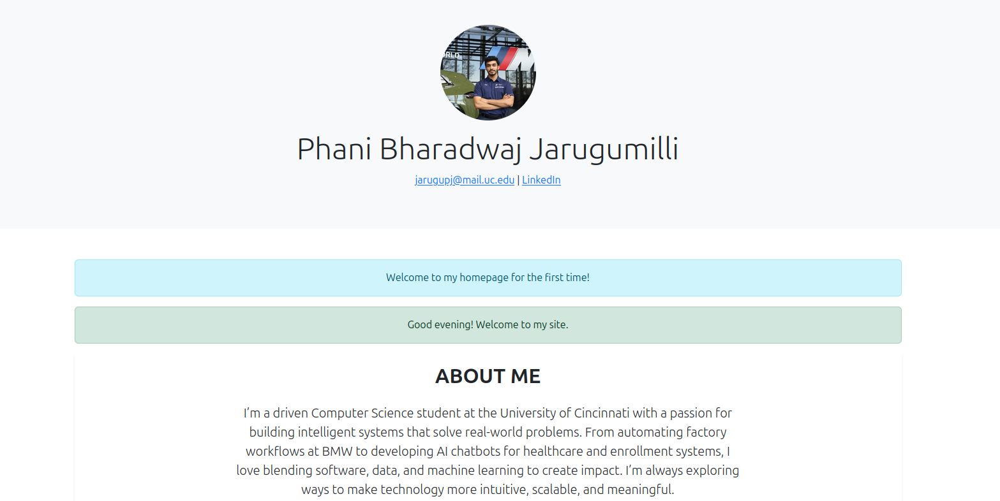
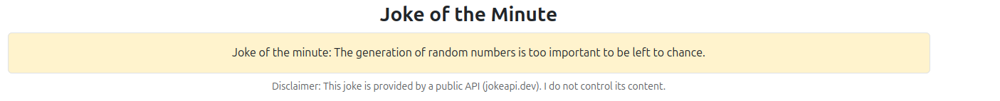
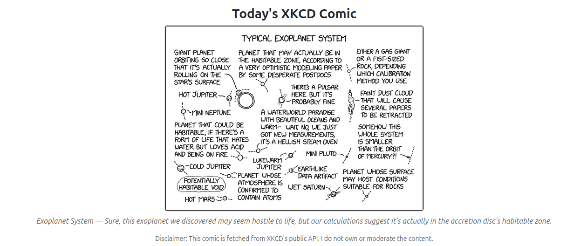
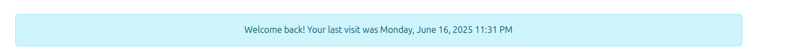
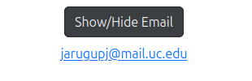

# WAPH – Web Application Programming and Hacking  
**Instructor:** Dr. Phu Phung  
**Individual Project 1 – Front-end Web Development**

---

## Student Information  
**Name:** Phani Bharadwaj Jarugumilli  
**Email:** [jarugupj@mail.uc.edu](mailto:jarugupj@mail.uc.edu)  
**UC ID:** M15116639  

---

## Website Links  
- Deployed Website on GitHub Pages: https://jarugupj.github.io  
- Project Source Code on GitHub: https://github.com/jarugupj/jarugupj.github.io

---

## Project Overview  
This individual project focused on building a professional front-end website and integrating it with public APIs using JavaScript and web technologies covered in the WAPH course. I deployed the site on GitHub Pages and structured it as a real-world profile to showcase my education, experience, and skills. I also applied key techniques from Lab 2, such as using jQuery, handling cookies, and integrating public APIs with disclaimers.

### Outcomes:
- Strengthened skills in HTML, CSS, and JavaScript (both vanilla and jQuery)
- Learned how to fetch and render data from third-party APIs
- Practiced managing cookies for dynamic user experiences
- Understood web deployment using GitHub Pages

---

## Task Breakdown

### Task 1: Professional Profile Website
- Created a fully responsive profile page using Bootstrap 5 for layout and components.
- Included personal bio, headshot, resume download, project showcases, education, and experience.
- Designed with employer targeting in mind, including clean UI and content emphasis.

---

### Task 2: JavaScript Functionalities

1. Show/Hide Email  
- A button toggles my email using an external function in `script.js`.

2. Digital Clock  
- Used `setInterval()` with `Date()` object to continuously update the current time.

3. Analog Clock  
- Leveraged provided `clock.js` script to render a canvas-based analog clock.

4. Greeting Based on Time  
- A greeting message (Good Morning / Afternoon / Evening) dynamically displays based on current system time.

---

### Task 3: Use of jQuery and One More JavaScript Library
- jQuery: Used for Joke API integration and DOM manipulation.
- Moment.js: Used for parsing and formatting timestamps in cookie-based greetings.

---

### Task 4: Web API Integration

1. JokeAPI  
- URL: https://v2.jokeapi.dev/joke/Any?type=single  
- Fetches and updates a new joke every 60 seconds using jQuery.  
- Disclaimer added: Notes that the content comes from a public API and is not moderated by me.

2. XKCD Comic API  
- URL: https://xkcd.com/info.0.json  
- Uses `fetch()` with a CORS proxy to render the latest comic and title.  
- Disclaimer added under the image stating that content comes from a third-party source.

---

### Task 5: JavaScript Cookies
- Used `setCookie()` and `getCookie()` functions to track user's last visit.
- Shows:
  - "Welcome to my homepage for the first time!" for new visitors.
  - "Welcome back! Your last visit was..." for returning users with formatted timestamps.

---

## Final Thoughts
Through this project, I gained hands-on experience with:
- Real-world web deployment and resume building
- Dynamic JavaScript interaction using libraries
- Responsible use of external APIs with user-facing disclaimers
- Cookie-based personalization of the web experience

This assignment helped me synthesize everything from Lab 2 and turn it into a polished and functional portfolio website.

---

## Screenshots

Below are high-resolution screenshots of my deployed website, each labeled with my name and captured directly from the live GitHub Pages deployment.

**Figure 1: Home Page Layout**  
The landing page includes my name, headshot, education, experience, skills, and resume download.  

**Figure 2: Joke Fetched from Public API**  
A live programming joke is displayed from JokeAPI and refreshed every 60 seconds.  

**Figure 3: XKCD Comic Display via Graphic API**  
Comic image, title, and alt text fetched from XKCD’s public API using JavaScript.  

**Figure 4: Cookie-Based Welcome Message**  
Returning visitors are greeted with their last visit time using JavaScript cookies.  

**Figure 5: Email Show/Hide Feature**  
Clicking the button toggles the visibility of my email using DOM manipulation.  

**Figure 6: Digital and Analog Clocks**  
Dynamic clocks rendered using JavaScript and canvas with live time updates.  

